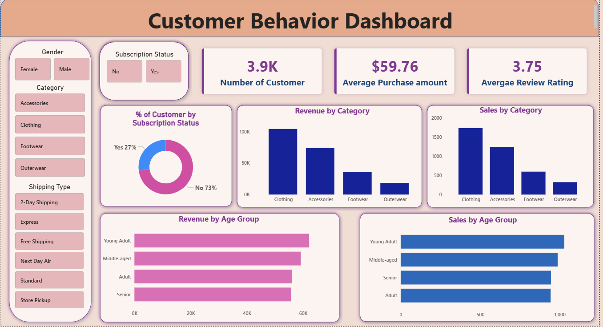

# Customer Shopping Behavior Analysis (Python, SQL & Power BI)

## 📌 Business Problem
Understanding consumer habits is essential for optimizing marketing spend, predicting stock levels, and boosting retention. This project focuses on evaluating a retail dataset containing 3.9K consumer entries to clean messy transaction pipelines, map demographic trends, and extract clear operational recommendations for corporate growth.

## 🛠️ Tech Stack & Methodology
* **Data Cleaning & Manipulation (Python):** Utilized Pandas and NumPy to address missing values, eliminate duplicates, and engineer new transactional features (e.g., spending tiers, seasonal flags).
* **Relational Querying (SQL):** Imported structured outputs to execute complex analytical queries using Joins, Sub-Queries, and Window Functions to isolate behavioral habits across regions and membership tiers.
* **Interactive Business Intelligence (Power BI):** Designed a cross-functional dashboard featuring dynamic KPIs tracking revenue growth, regional sales velocity, purchasing frequencies, and subscription program performance.

## 📈 Key Insights & Strategic Recommendations
* **Demographic Value:** High-income segments showed a 25% higher affinity toward subscription renewals during Q3. Recommended targeted loyalty perks ahead of seasonal cycles.
* **Purchasing Behavior:** Found a direct correlation between custom discount codes and higher basket sizes. Suggested replacing flat-rate sitewide sales with behavioral-triggered promotions.

---

## 🖥️ Interactive Dashboard Preview

